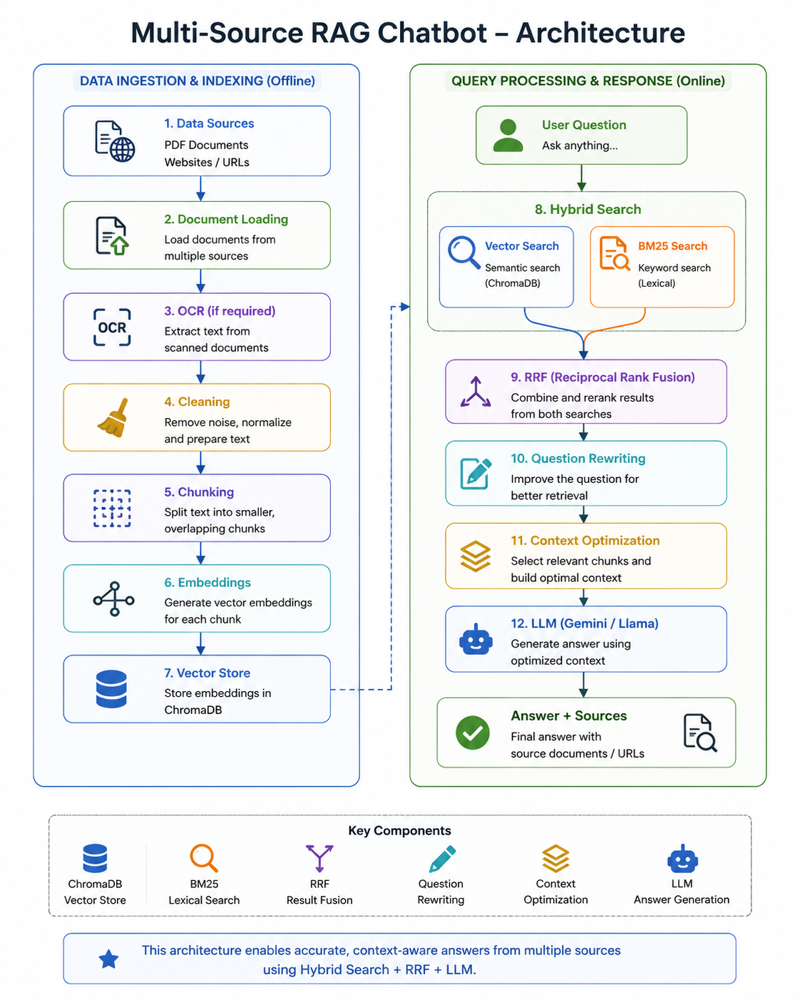

# Multi-Source RAG Chatbot

A Retrieval-Augmented Generation (RAG) chatbot built with Python that can answer questions using information from multiple sources, including PDF documents and websites.

The system combines document processing, OCR, embeddings, ChromaDB, BM25 keyword retrieval, hybrid retrieval, Reciprocal Rank Fusion (RRF), conversational question rewriting, context optimization, and source attribution.

## Features

- PDF document ingestion
- OCR support for scanned/image-based PDFs
- Website crawling and content extraction
- Document cleaning and preprocessing
- Recursive text chunking
- Embedding-based semantic search
- ChromaDB vector database
- BM25 keyword-based retrieval
- Hybrid retrieval
- Reciprocal Rank Fusion (RRF)
- Conversational question rewriting
- Context optimization
- LLM-based answer generation
- Source attribution
- Streamlit chatbot interface
- RAG evaluation framework

## Architecture



### RAG Pipeline

```text
PDF / Website
      |
      v
Document Loaders
+ OCR if required
      |
      v
Document Cleaning
      |
      v
Chunking
      |
      v
Embeddings
      |
      v
ChromaDB
      |
      +----------------------+
      |                      |
      v                      v
Vector Search          BM25 Search
      |                      |
      +----------+-----------+
                 |
                 v
        Hybrid Retrieval
              + RRF
                 |
                 v
       Question Rewriting
        using Chat History
                 |
                 v
       Context Optimization
                 |
                 v
                LLM
                 |
                 v
          Answer + Sources