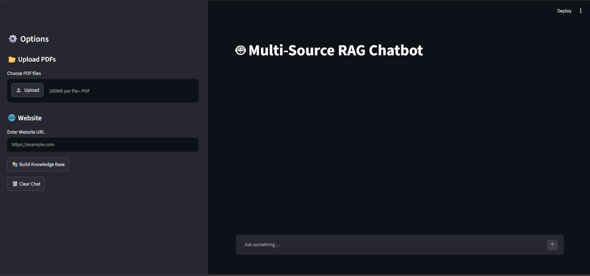

# Multi-Source RAG Chatbot


A Retrieval-Augmented Generation (RAG) chatbot built with Python that can answer questions using information from multiple sources, including PDF documents and websites.

The system combines document processing, OCR, embeddings, ChromaDB, BM25 keyword retrieval, hybrid retrieval, Reciprocal Rank Fusion (RRF), conversational question rewriting, context optimization, and source attribution.

## Features

- PDF document ingestion
- OCR support for scanned/image-based PDFs
- Website crawling and content extraction
- Document cleaning and preprocessing
- Recursive text chunking
- Embedding-based semantic search
- ChromaDB vector database
- BM25 keyword-based retrieval
- Hybrid retrieval
- Reciprocal Rank Fusion (RRF)
- Conversational question rewriting
- Context optimization
- LLM-based answer generation
- Source attribution
- Streamlit chatbot interface
- RAG evaluation framework

## Architecture




## Evaluation

The RAG pipeline was evaluated using 10 domain-specific questions covering
retrieval accuracy and answer quality.

| Metric | Result |
|---|---:|
| Total Questions | 10 |
| Retrieval Passed | 10/10 |
| Retrieval Failed | 0 |
| Retrieval Accuracy | **100%** |
| Answer Quality Passed | 9/10 |
| Answer Quality Failed | 1 |
| Answer Quality Accuracy | **90%** |

The evaluation verifies the performance of the hybrid retrieval pipeline
combining vector search, BM25 keyword retrieval, and Reciprocal Rank Fusion (RRF).
## Installation

### 1. Clone the repository

```bash
git clone https://github.com/pavanpa1403/multi-source-rag-chatbot.git
cd multi-source-rag-chatbot

